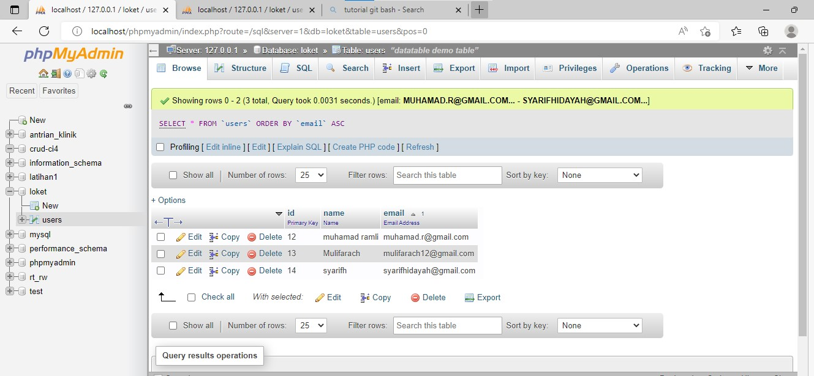
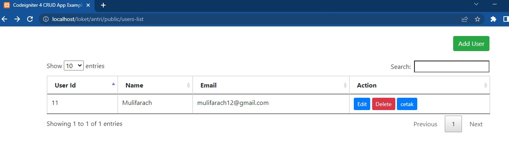
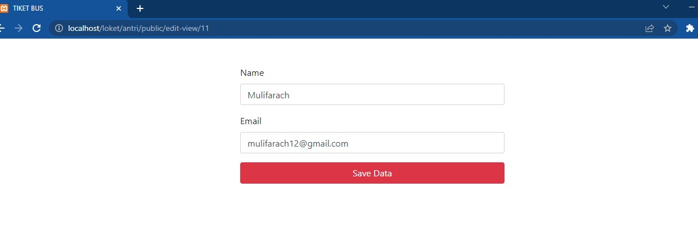
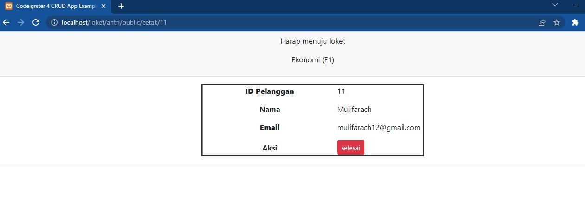
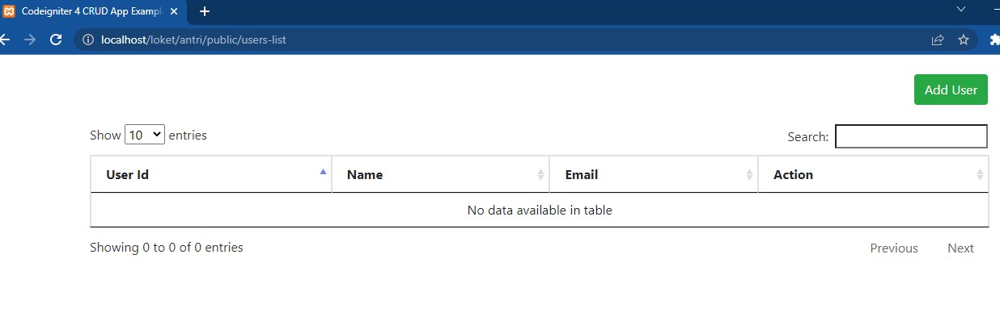
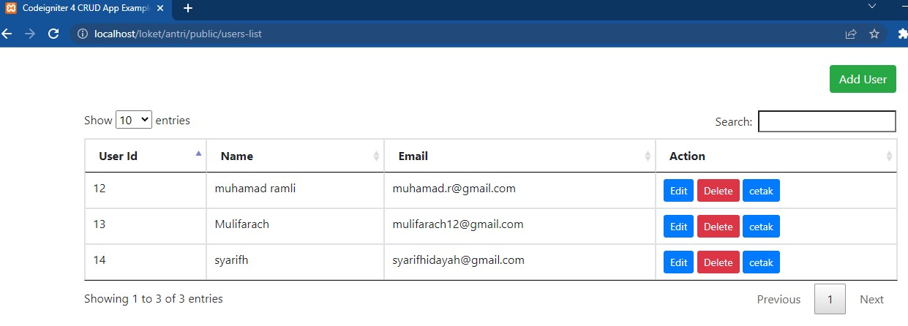

# UAS_AntrianLoket

Pratikum ini dibuat untuk memenuhi UAS PEMROGRAMAN WEB

Nama    : Mulifatkhul Rachiim

NIM     : 312010180

Kelas   : TI.20.B1

Langkah Awal membuat dokumen di xampp dan di coba di localhost php admin

selanjutnya membuat add user

dan refresh kembali web browser

lalu 

refresh kembali dan muncul antrian sesuai nama yang di ketik di add user

lalu

sekian dari saya

Terimakasih 